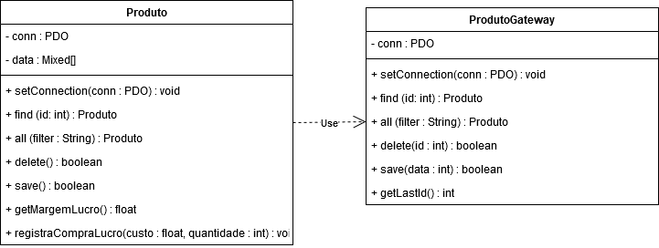

## Table Data Gateway

O objetivo deste Design Pattern é oferecer uma interface de comunicação com o banco de dados que permite operações de inserção, alteração, exclusão e busca de registros.

Consiste em criar uma classe para manipulação de cada tabela do banco de dados, e apenas uma instância dessa classe irá manipular todos os registros da tabela, por isso é necessário sempre identificar o registro sobre o qual o método estará operando. Está classe é stateless, servido apenas como ponte entre o objeto de negócio e o banco de dados.


Para exemplificar seu uso criamos a classe ProdutoGateway no arquivo [ProdutoGateway.php](../../../exemplos-do-livro/cap5/classes/tdg/ProdutoGateway.php). Esta classe possui os métodos de gravação (save), exclusão (delete) e busca (find, all). O método setConnection usará injeção de dependência para receber uma conexão ativa e guarda-la em uma propriedade estática.

```php
<?php
class ProdutoGateway
{
    private static $conn;
    
    public static function setConnection( PDO $conn )
    {
        self::$conn = $conn;
    }
    
    public function find($id, $class = 'stdClass')
    {
        $sql = "SELECT * FROM produto where id = '$id' ";
        print "$sql <br>\n";
        $result = self::$conn->query($sql);
        return $result->fetchObject($class);
    }

    public function all($filter, $class = 'stdClass')
    {
        $sql = "SELECT * FROM produto  ";
        if ($filter) {
            $sql .= "where $filter";
        }
        print "$sql <br>\n";
        $result = self::$conn->query($sql);
        return $result->fetchAll(PDO::FETCH_CLASS, $class);
    }

    public function delete($id)
    {
        $sql = "DELETE FROM produto where id = '$id' ";
        print "$sql <br>\n";
        return self::$conn->query($sql);
    }

    public function save($data)
    {
        if (empty($data->id)) {
            $id = $this->getLastId() +1;
            $sql = "INSERT INTO produto (id, descricao, estoque, preco_custo, ".
                                   "      preco_venda, codigo_barras, data_cadastro, origem)" .
                                   " VALUES ('{$id}', " .
                                            "'{$data->descricao}', " .
                                            "'{$data->estoque}', " .
                                            "'{$data->preco_custo}', " .
                                            "'{$data->preco_venda}', " .
                                            "'{$data->codigo_barras}', " .
                                            "'{$data->data_cadastro}', " .
                                            "'{$data->origem}')";
        }
        else {
            $sql = "UPDATE produto SET descricao     = '{$data->descricao}', " .
                                "       estoque       = '{$data->estoque}', " .
                                "       preco_custo   = '{$data->preco_custo}', " .
                                "       preco_venda   = '{$data->preco_venda}', ".
                                "       codigo_barras = '{$data->codigo_barras}', ".
                                "       data_cadastro = '{$data->data_cadastro}', ".
                                "       origem        = '{$data->origem}' ".
                                "WHERE  id            = '{$data->id}'";
        }
        print "$sql <br>\n";
        return self::$conn->exec($sql);   // executa instrucao SQL
    }
    
    private function getLastId()
    {
        $sql = "SELECT max(id) as max FROM produto";
        $result = self::$conn->query($sql);
        $data = $result->fetch(PDO::FETCH_OBJ);
        return $data->max;
    }
}
```

O arquivo [exemplo_tdg.php](../../../exemplos-do-livro/cap5/exemplo_tdg.php) exemplifica o uso desta classe. O objeto a ser passado para o método save é criado usando a classe StdClass que permite a criação de um objeto sem a criação de uma estrutura.

```php
<?php
require_once 'classes/tdg/ProdutoGateway.php';

$data = new stdClass;
$data->descricao     = 'Vinho Brasileiro Tinto Merlot';
$data->estoque       = 8;
$data->preco_custo   = 12;
$data->preco_venda   = 18;
$data->codigo_barras = '13523453234234';
$data->data_cadastro = date('Y-m-d');
$data->origem        = 'N';

try {
    $conn = new PDO('sqlite:database/estoque.db');
    $conn->setAttribute(PDO::ATTR_ERRMODE, PDO::ERRMODE_EXCEPTION);
    ProdutoGateway::setConnection($conn);
    
    $gw = new ProdutoGateway;
    $gw->save($data);
    
    $produto = $gw->find(1);
    $produto->estoque += 2;
    $gw->save($produto );
    
    foreach ($gw->all("estoque<=10") as $produto){
        print $produto->descricao . "<br>\n";
    }
}
catch (Exception $e)
{
    print $e->getMessage();
}
```

O Table Data Gateway não foi projetado para funcionar sozinho, ele precisa de um objeto de domínio. Neste exemplo criaremos a classe produto que terá os métodos setConnection, find, all, delete e save que são métodos de persistências que passaram seus parametros para a classe de Table Data Gateway, além de getMargemLucro e registraCompra que são métodos de negócio.



A classe Produto usa a classe Table Data Gateway, configurando uma relação de composição, já que a classe ProdutoGatewayExample (parte) é instânciada e usada dentro do objeto Produto (todo)

[Produtos.php](../../../exemplos-do-livro/cap5/classes/tdg/Produto.php)

```php
<?php
class Produto
{
    private static $conn;
    private $data;

    function __get($prop)
    {
        return $this->data[$prop];
    }

    function __set($prop, $value)
    {
        $this->data[$prop] = $value;
    }

    public static function setConnection( PDO $conn )
    {
        self::$conn = $conn;
        ProdutoGateway::setConnection($conn);
    }

    public static function find($id)
    {
        $gw = new ProdutoGateway;
        return $gw->find($id, 'Produto');
    }

    public static function all($filter = '')
    {
        $gw = new ProdutoGateway;
        return $gw->all($filter, 'Produto');
    }
    
    public function delete()
    {
        $gw = new ProdutoGateway;
        return $gw->delete($this->id);
    }
    
    public function save()
    {
        $gw = new ProdutoGateway;
        return $gw->save( (object) $this->data);
    }

    public function getMargemLucro()
    {
        return (($this->preco_venda-$this->preco_custo) / $this->preco_custo) * 100;
    }

    public function registraCompra($custo, $quantidade)
    {
        $this->custo = $custo;
        $this->estoque += $quantidade;
    }
}
```

No script [exemplo_tdg2.php](../../exemplos-do-livro/cap5/exemplo_tdg2.php), podemos ver um exemplo de uso da Table Data Gateway.

```php
<?php
require_once 'classes/tdg/Produto.php';
require_once 'classes/tdg/ProdutoGateway.php';

try {
    $conn = new PDO('sqlite:database/estoque.db');
    $conn->setAttribute(PDO::ATTR_ERRMODE, PDO::ERRMODE_EXCEPTION);
    Produto::setConnection($conn);
    
    $produtos = Produto::all();
    foreach ($produtos as $produto) {
        $produto->delete();
    }
    
    $produto = new Produto;
    $produto->descricao     = 'Vinho Brasileiro Tinto Merlot';
    $produto->estoque       = 10;
    $produto->preco_custo   = 12;
    $produto->preco_venda   = 18;
    $produto->codigo_barras = '13523453234234';
    $produto->data_cadastro = date('Y-m-d');
    $produto->origem        = 'N';
    $produto->save();
    
    $outro = Produto::find(1);
    print 'Descrição: ' . $outro->descricao . "<br>\n";
    print 'Lucro: '     . $outro->getMargemLucro() . "% <br>\n";
    
    $outro->registraCompra(14, 5);
    $outro->save();
}
catch (Exception $e)
{
    print $e->getMessage();
}
```