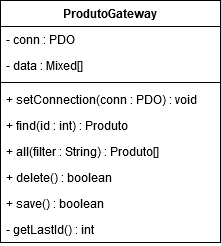

# Row Data Gateway

A Table Data Gateway não armazena uma instância do registro no banco de dados, assim toda vez que é preciso acessa-lo, é necessário passar os dados novamente. Então o padrão Row Data Gateway tem o objetivo de suprir essa característica, quando é necessário ter uma instância do registro. 

No RDG, cada instância da classe representa um registro diferente no banco de dados. As propriedades representam as colunas do banco de dados e provê métodos de persistência. Este padrão é stateful, ou seja, mantém os valores de suas propriedades ao longo do seu ciclo de vida, não necessitando passar valores via parâmetro para obter os mesmos dados novamente. Nesta estrutura simulamos melhor o formato de um objeto em um registro.

A desvantagem é que ele é ligeiramente mais pessado para a memória do que o Table Data Gateway, já que ele mantém a instância alocada na memória até sua destruição.



A classe [ProdutoGateway](../../../exemplos-do-livro/cap5/classes/rdg/ProdutoGateway.php) demonstra uma implementação de RDG. Os atributos do registros serão armazenados no veto $this->data. Os métodos find() e all() retornaram objetos da propria classe ProdutoGateway. A constante __CLASS__ representa a própria classe que é utilizada. Os métodos save() e delete() não precisarão preceber parâmetros, pois os dados da operação estarão no vetor $this->data. 

```php
<?php
class ProdutoGateway
{
    private static $conn;
    private $data;
    
    function __get($prop)
    {
        return $this->data[$prop];
    }

    function __set($prop, $value)
    {
        $this->data[$prop] = $value;
    }
    
    public static function setConnection( PDO $conn )
    {
        self::$conn = $conn;
    }
    
    public static function find($id)
    {
        $sql = "SELECT * FROM produto where id = '$id' ";
        print "$sql <br>\n";
        $result = self::$conn->query($sql);
        return $result->fetchObject(__CLASS__);
    }

    public static function all($filter = '')
    {
        $sql = "SELECT * FROM produto  ";
        if ($filter) {
            $sql .= "where $filter";
        }
        print "$sql <br>\n";
        $result = self::$conn->query($sql);
        return $result->fetchAll(PDO::FETCH_CLASS, __CLASS__);
    }
    
    public function delete()
    {
        $sql = "DELETE FROM produto where id = '{$this->id}' ";
        print "$sql <br>\n";
        return self::$conn->query($sql);
    }

    public function save()
    {
        if (empty($this->data['id'])) {
            $id = $this->getLastId() +1;
            $sql = "INSERT INTO produto (id, descricao, estoque, preco_custo, ".
                                   "      preco_venda, codigo_barras, data_cadastro, origem)" .
                                   " VALUES ('{$id}', " .
                                            "'{$this->descricao}', " .
                                            "'{$this->estoque}', " .
                                            "'{$this->preco_custo}', " .
                                            "'{$this->preco_venda}', " .
                                            "'{$this->codigo_barras}', " .
                                            "'{$this->data_cadastro}', " .
                                            "'{$this->origem}')";
        }
        else {
            $sql = "UPDATE produto SET descricao     = '{$this->descricao}', " .
                                "       estoque       = '{$this->estoque}', " .
                                "       preco_custo   = '{$this->preco_custo}', " .
                                "       preco_venda   = '{$this->preco_venda}', ".
                                "       codigo_barras = '{$this->codigo_barras}', ".
                                "       data_cadastro = '{$this->data_cadastro}', ".
                                "       origem        = '{$this->origem}' ".
                                "WHERE  id            = '{$this->id}'";
        }
        print "$sql <br>\n";
        return self::$conn->exec($sql);   // executa instrucao SQL
    }
    
    private function getLastId()
    {
        $sql = "SELECT max(id) as max FROM produto";
        $result = self::$conn->query($sql);
        $data = $result->fetch(PDO::FETCH_OBJ);
        return $data->max;
    }
}
```

Vamos demostrar sua utilização através do arquivo [exemplo_rdg.php](../../../exemplos-do-livro/cap5/exemplo_rdg.php).

```php
<?php
require_once 'classes/rdg/ProdutoGateway.php';

try {
    $conn = new PDO('sqlite:database/estoque.db');
    $conn->setAttribute(PDO::ATTR_ERRMODE, PDO::ERRMODE_EXCEPTION);
    ProdutoGateway::setConnection($conn);
    
    $produtos = ProdutoGateway::all();
    foreach ($produtos as $produto) {
        $produto->delete();
    }
    
    $p1 = new ProdutoGateway;
    $p1->descricao     = 'Vinho Brasileiro Tinto Merlot';
    $p1->estoque       = 10;
    $p1->preco_custo   = 12;
    $p1->preco_venda   = 18;
    $p1->codigo_barras = '13523453234234';
    $p1->data_cadastro = date('Y-m-d');
    $p1->origem        = 'N';
    $p1->save();
    
    $p2 = new ProdutoGateway;
    $p2->descricao     = 'Vinho Importado Tinto Carmenere';
    $p2->estoque       = 10;
    $p2->preco_custo   = 18;
    $p2->preco_venda   = 29;
    $p2->codigo_barras = '73450345423423';
    $p2->data_cadastro = date('Y-m-d');
    $p2->origem        = 'I';
    $p2->save();
    
    $produto = ProdutoGateway::find(1);
    $produto->estoque += 2;
    $produto->save();
}
catch (Exception $e) {
    print $e->getMessage();
}
```

> O uso de setConnection como estático pemite que ela compartilhe a conexão entre as instâncias de Produto Gateway, não sendo necessário definir nova conexão para cada instância de ProdutoGateway dentro do mesmo tempo de execução.