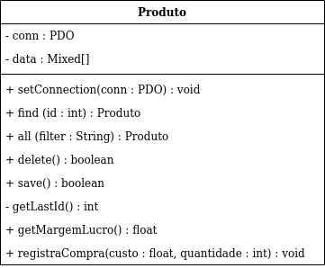

# Active Record

O Active Record é um Design Pattern derivado do
[Row Data Gateway](../02-row-data-gateway/README.md), basicamente ele possui os
mesmo métodos de persistência, com a diferença que possui métodos de negócios
que possem a lógica de negócio (modelo de domínio). Segue abaixo um schema do
objeto Produto implementando Active Record.



Esse Design Pattern serve bem quando o modelo de dados se parece com o modelo
de negócios. Segue abaixo o código do
[Produto.php](../../../exemplos-do-livro/cap5/classes/ar/Produto.php) que implementa
esse Active Record.

```php
<?php
class Produto
{
    private static $conn;
    private $data;

    function __get($prop)
    {
        return $this->data[$prop];
    }

    function __set($prop, $value)
    {
        $this->data[$prop] = $value;
    }

    public static function setConnection( PDO $conn )
    {
        self::$conn = $conn;
    }

    public static function find($id)
    {
        $sql = "SELECT * FROM produto where id = '$id' ";
        print "$sql <br>\n";
        $result = self::$conn->query($sql);
        return $result->fetchObject(__CLASS__);
    }

    public static function all($filter = '')
    {
        $sql = "SELECT * FROM produto  ";
        if ($filter) {
            $sql .= "where $filter";
        }
        print "$sql <br>\n";
        $result = self::$conn->query($sql);
        return $result->fetchAll(PDO::FETCH_CLASS, __CLASS__);
    }

    public function delete()
    {
        $sql = "DELETE FROM produto where id = '{$this->id}' ";
        print "$sql <br>\n";
        return self::$conn->query($sql);
    }

    public function save()
    {
        if (empty($this->data['id'])) {
            $id = $this->getLastId() +1;
            $sql = "INSERT INTO produto (id, descricao, estoque, preco_custo, ".
                                   "      preco_venda, codigo_barras, data_cadastro, origem)" .
                                   " VALUES ('{$id}', " .
                                            "'{$this->descricao}', " .
                                            "'{$this->estoque}', " .
                                            "'{$this->preco_custo}', " .
                                            "'{$this->preco_venda}', " .
                                            "'{$this->codigo_barras}', " .
                                            "'{$this->data_cadastro}', " .
                                            "'{$this->origem}')";
        }
        else {
            $sql = "UPDATE produto SET descricao     = '{$this->descricao}', " .
                                "       estoque       = '{$this->estoque}', " .
                                "       preco_custo   = '{$this->preco_custo}', " .
                                "       preco_venda   = '{$this->preco_venda}', ".
                                "       codigo_barras = '{$this->codigo_barras}', ".
                                "       data_cadastro = '{$this->data_cadastro}', ".
                                "       origem        = '{$this->origem}' ".
                                "WHERE  id            = '{$this->id}'";
        }
        print "$sql <br>\n";
        return self::$conn->exec($sql);   // executa instrucao SQL
    }

    private function getLastId()
    {
        $sql = "SELECT max(id) as max FROM produto";
        $result = self::$conn->query($sql);
        $data = $result->fetch(PDO::FETCH_OBJ);
        return $data->max;
    }

    public function getMargemLucro()
    {
        return (($this->preco_venda-$this->preco_custo) / $this->preco_custo) * 100;
    }

    public function registraCompra($custo, $quantidade)
    {
        $this->custo = $custo;
        $this->estoque += $quantidade;
    }
}
```

No arquivo [exemplo_ar.php](../../../exemplos-do-livro/cap5/exemplo_ar.php) temos a aplicação deste modelo.

```php
<?php
require_once 'classes/ar/Produto.php';

try {
    $conn = new PDO('sqlite:database/estoque.db');
    $conn->setAttribute(PDO::ATTR_ERRMODE, PDO::ERRMODE_EXCEPTION);
    Produto::setConnection($conn);

    $produtos = Produto::all();
    foreach ($produtos as $produto) {
        $produto->delete();
    }

    $produto = new Produto;
    $produto->descricao     = 'Vinho Brasileiro Tinto Merlot';
    $produto->estoque       = 10;
    $produto->preco_custo   = 12;
    $produto->preco_venda   = 18;
    $produto->codigo_barras = '13523453234234';
    $produto->data_cadastro = date('Y-m-d');
    $produto->origem        = 'N';
    $produto->save();

    $outro = Produto::find(1);
    print 'Descrição: ' . $outro->descricao . "<br>\n";
    print 'Lucro: '     . $outro->getMargemLucro() . "% <br>\n";
    $outro->registraCompra(14, 5);
    $outro->save();
}
catch (Exception $e)
{
    print $e->getMessage();
}
```
