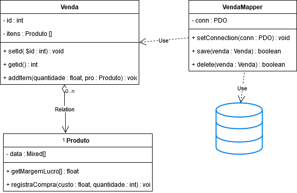

# Data Mapper

Este Design Pattern tem o objetivo de separar o objeto de domínio e o objeto de
persistência. Essa necessidade surge quando o registro não representa um
modelo de dados, por exemplo, em uma situação onde haja um relacionamento entre
dois objetos, o Data Mapper se faz muita valia[^1].

A diferença do Active Record é que esse padrão não implementa metódos de
persistência, deixando essa responsabilidade para o objeto de DataMapper. Assim,
esse formato segue o princípio de responsabilidade simples (Single
Responsibility Principle)[^2].

No exemplo a seguir teremos uma situação da gravação de uma venda, essa venda
possuirá muitos itens. Então teremos dois objetos de domínio (Venda e Produto)
e um objeto de persistência VendaMapper. Existe um relacionamento de agregação
entre Venda e Produto, uma Venda possuirá muitos Produtos. Venda receberá esses
objetos através do método addItem(quantidade : float, pro : Produto), Venda não
instanciará Produto por isso é uma associação[^2].

## Exemplos do livro
- [Produto.php](../../../exemplos-do-livro/cap5/classes/dm/Produto.php)
- [Venda.php](../../../exemplos-do-livro/cap5/classes/dm/Venda.php)
- [VendaMapper.php](../../../exemplos-do-livro/cap5/classes/dm/VendaMapper.php)
- [exemplo_dm.php](../../../exemplos-do-livro/cap5/exemplo_dm.php)

## Fontes
[^1]: DALL'OGLIO Pablo. PHP: Programando com Orientação a Objetos. 3 ed. 3ª Reimpressão. São Paulo: Novatec Editora Ltda, 2017  
[^2]: https://designpatternsphp.readthedocs.io/pt_BR/latest/Structural/DataMapper/README.html
