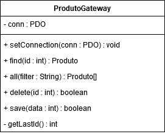

# Gateways

Um Gateway é uma interface que se comunica com um recurso externo escondendo seus detalhes. Assim a aplicação só precisará conhecer essas interfaces para manipular as informações. 

O acesso a linguagem SQL fica nessa camada, desta forma evitamos manipular dados de forma espalhada pela a aplicação.

## Table Data Gateway

O objetivo deste Design Pattern é oferecer uma interface de comunicação com o banco de dados que permite operações de inserção, alteração, exclusão e busca de registros.

Consiste em criar uma classe para manipulação de cada tabela do banco de dados, e apenas uma instância dessa classe irá manipular todos os registros da tabela, por isso é necessário sempre identificar o registro sobre o qual o método estará operando. Está classe é stateless, servido apenas como ponte entre o objeto de negócio e o banco de dados.

Para exemplificar seu uso criamos a classe ProdutoGateway no arquivo [ProdutoGateway.php](ProdutoGatewayExemple/ProdutoGateway.php). Está class possui os métodos de gravação (save), exclusão (delete) e busca (find, all). O método setConnection usará injeção de dependência para receber uma conexão ativa e guarda-la em uma propriedade estática.

O método find recebe o ID do registro como parâmetro, executa uma query simples para busca-lo no banco e retorna como um objeto. O método all recebe opcionalmente um parâmetro para receber filtros para a querry, o objetivo é retornar todos os dados da tabela em um array de objetos. O método delete recebe um ID e executa uma query para apagar esse ID.

O método save() é responsável por persistir o registro na base de dados. Ele recebe como parâmetro um objeto de transporte de dados, conhecido pelo nome de Data Transfer Object. Um Data Transfer Object é um objeto sem relacionamentos usado como parâmetro de um método para transportar dados para ele através de propriedades. O método save tem dupla função, inserir um registro novo, quando este não existe, ou atualizar um registro já existente.

O arquivo [exemplo_tdg.php](ProdutoGatewayExemple/exemplo_tdg.php) exemplifica o uso desta classe. O objeto a ser passado para o método save é criado usando a classe StdClass que permite a criação de um objeto sem a criação de uma estrutura.